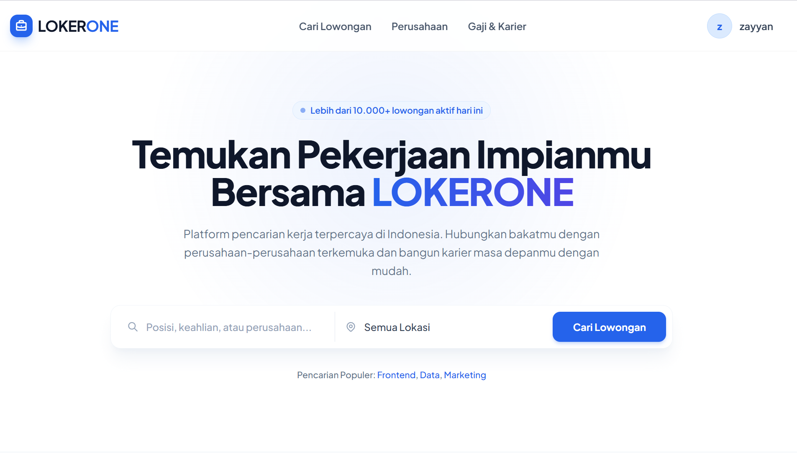
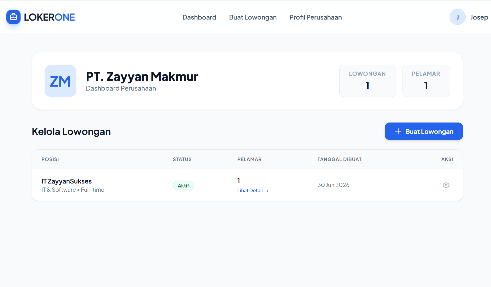

# 🚀 LokerOne - Job Portal Platform


LokerOne adalah platform pencarian kerja modern dan terpercaya di Indonesia yang menghubungkan talenta terbaik dengan perusahaan-perusahaan terkemuka. Dibangun dengan fokus pada kecepatan, kemudahan penggunaan, dan antarmuka pengguna (UI) yang dinamis, bersih, serta profesional.

---

## 📸 Cuplikan Layar (Screenshots)
*(Di bawah ini adalah Screenshots beranda atau tampilan awal dari LOKERONE dan yang kedua adalah dashboard dari sisi role perusahaan untuk melihat dan mengelola lamaran dari pelamar di PT tersebut)*

| Halaman Beranda | Dashboard Perusahaan |
| :---: | :---: |
|  |  |

---

## ✨ Fitur Utama

### 🧑‍💼 Untuk Pencari Kerja (Pelamar)
* **Cari & Filter Lowongan:** Pencarian cepat berdasarkan kata kunci, lokasi, dan kategori dengan fitur *auto-scroll* yang cerdas.
* **Pencarian Populer:** Akses instan ke kategori pekerjaan yang paling banyak dicari (Frontend, Data, Marketing, dll).
* **Profil & Lamaran Saya:** Lacak status semua lamaran kerja (Menunggu, Direview, Diterima, Ditolak) secara *real-time*.
* **Gaji & Karier:** Lihat rata-rata statistik gaji per industri berdasarkan data terkini, dilengkapi tips karier profesional.

### 🏢 Untuk Perusahaan (Employer)
* **Dashboard Perusahaan Khusus:** Kelola lowongan kerja dan pantau statistik pelamar di satu tempat terpusat.
* **Buat Lowongan Baru:** Publikasikan lowongan kerja baru dengan mudah, termasuk detail gaji (opsional) dan tag lokasi (*remote/on-site*).
* **Applicant Tracking System (ATS):** Lihat profil pelamar, baca *cover letter*, dan ubah status lamaran dalam satu klik.
* **Profil & Branding Perusahaan:** Personalisasi halaman perusahaan publik dengan deskripsi, lokasi, website, hingga fitur unggah logo perusahaan.

---

## 🛠️ Teknologi yang Digunakan

* **Backend:** PHP 8.1+ (Native dengan PDO)
* **Database:** MySQL (Relational Database)
* **Frontend:** HTML5, Vanilla JavaScript, Tailwind CSS (via CDN)
* **Desain UI/UX:** Pendekatan *Glassmorphism*, animasi interaktif (*hover/micro-interactions*), dan desain berbasis komponen.

---

## 💻 Cara Instalasi & Menjalankan (Local Development)

Proyek ini dirancang agar sangat mudah dijalankan menggunakan environment lokal seperti **Laragon** atau **XAMPP**.

### 1. Persiapan Database
1. Buat database baru di MySQL dengan nama `lokerone`.
2. Buat tabel-tabel utama (atau import file `.sql` jika tersedia). Pastikan struktur tabel berikut ada:
   * `users` (id, name, email, password, role, company_id)
   * `companies` (id, name, logo_initial, logo_path, color, description, location, website)
   * `jobs` (id, company_id, title, description, requirements, category, type, location_key, location_label, status)
   * `applications` (id, job_id, user_id, full_name, email, phone, cover_letter, status)

### 2. Menjalankan Aplikasi
Gunakan skrip *wrapper* ringan yang telah disediakan agar tidak perlu memindahkan file ke folder `htdocs` atau `www`. Buka terminal pada direktori proyek dan jalankan:

```bash
php run.php
